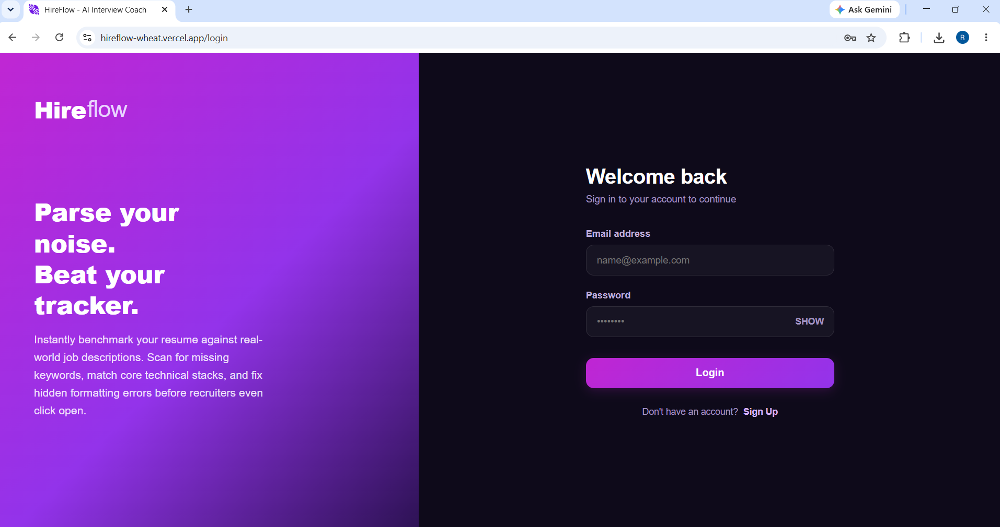
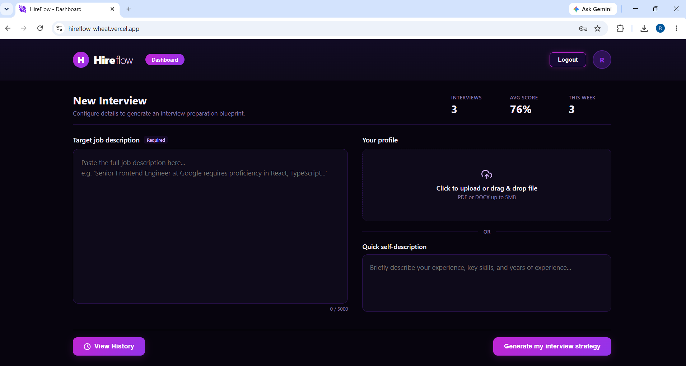
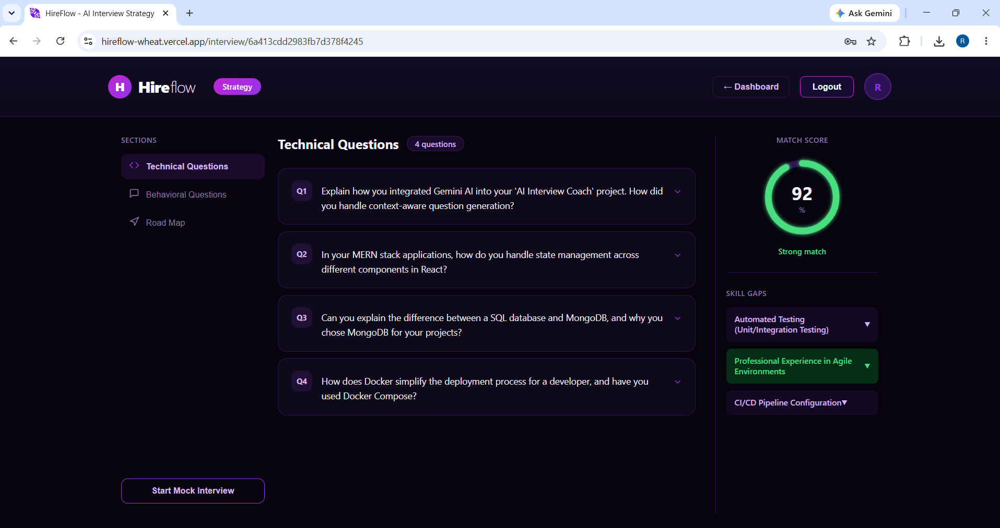
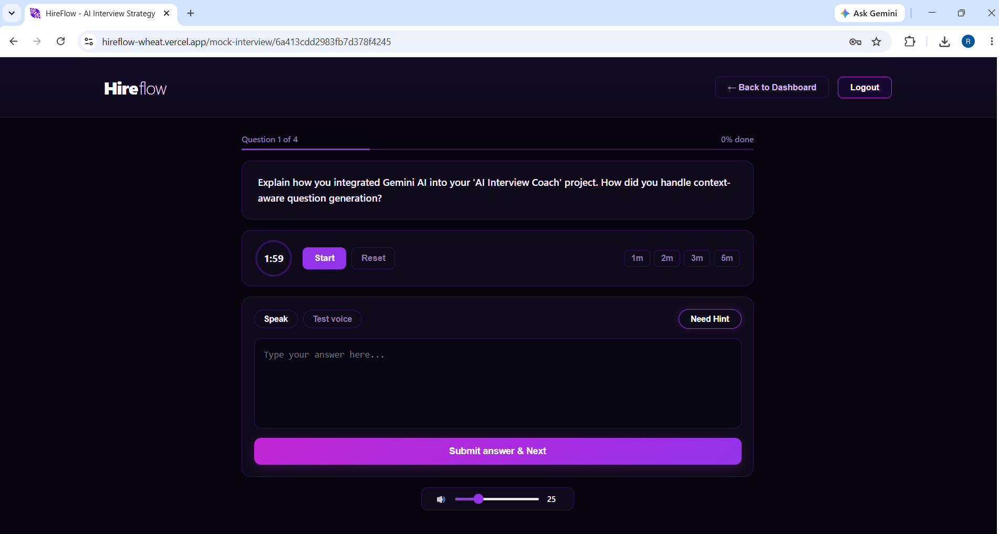
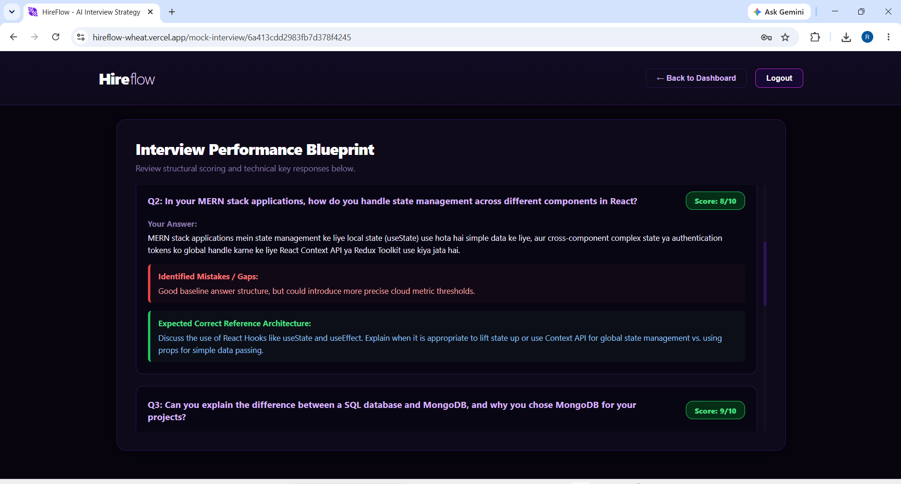

<div align="center">

# 🎯 HireFlow

### AI-Powered Resume & Interview Prep Platform

<p>
  
  
  
  
  
  
  
</p>

**HireFlow** is a full-stack AI interview-prep platform that benchmarks your resume against a real job description, generates a personalized set of technical and behavioral questions, runs a timed mock interview with voice support, and scores every answer with detailed AI feedback — so you know exactly where you stand before the real interview.

🔗 **[Live Demo](https://hireflow-wheat.vercel.app)**

</div>

---

## 📋 Table of Contents

1. [Overview](#-overview)
2. [Screenshots](#-screenshots)
3. [Tech Stack](#️-tech-stack)
4. [Key Features](#-key-features)
5. [How the AI Pipeline Works](#-how-the-ai-pipeline-works)
6. [Architecture Highlights](#️-architecture-highlights)
7. [Project Structure](#-project-structure)
8. [Getting Started](#-getting-started)
9. [Environment Variables](#-environment-variables)
10. [Future Improvements](#-future-improvements)
11. [Author](#-author)

---

## 🤖 Overview

**HireFlow** takes the guesswork out of interview prep. Instead of generic question banks, it reads your **actual resume** and the **actual job description** you're targeting, matches them, and builds a custom interview strategy around the gap between the two.

- **Parse & Match** — upload a resume (or write a quick self-description) and paste a target job description; HireFlow scores the match and flags missing keywords, skills, and formatting issues
- **Strategy Generation** — get a tailored set of technical and behavioral questions, grouped by section, along with a roadmap of skill gaps to close before the interview
- **Mock Interview** — a timed, voice-enabled practice round where you answer each question live, exactly like the real thing
- **AI Scorecard** — every answer is scored out of 10 with identified mistakes and an "expected reference answer," so feedback is specific, not generic

Built with **React (Vite)** on the frontend and **Node.js / Express + MongoDB** on the backend, with **Google's Gemini API** powering resume matching, question generation, and answer evaluation.

---

## 📸 Screenshots

<div align="center">

### Login


### Dashboard — New Interview Setup


### AI Interview Strategy — Match Score & Skill Gaps


### Mock Interview — Timed, Voice-Enabled


### Interview Performance Blueprint — AI Scorecard


</div>


## ⚙️ Tech Stack

| Layer | Technology | Purpose |
|---|---|---|
| Frontend Framework | **React + Vite** | Fast SPA build & dev experience |
| Routing | **React Router** | Client-side routing (`app.routes.jsx`) |
| Backend | **Node.js + Express** | REST API, auth, business logic |
| Database | **MongoDB** | Users, interviews, scorecards, history |
| Auth | **JWT + Cookies** | Secure session-based authentication |
| AI | **Google Gemini API** | Resume-JD matching, question generation, answer scoring |
| Deployment (Frontend) | **Vercel** | CI/CD and hosting for the client |
| Deployment (Backend) | **Render** | Hosting for the Express API |

---

## 🔋 Key Features

### 📄 Resume & Job Match
- **Resume Upload** — drag-and-drop PDF/DOCX upload, or a quick self-description as a fallback
- **Job Description Matching** — paste any job description and get a **Match Score** (e.g. `92% — Strong match`)
- **Skill Gap Detection** — automatically surfaces missing or weak skills (e.g. *Automated Testing*, *CI/CD Pipeline Configuration*) so you know exactly what to brush up on

### 🧠 AI Interview Strategy
- **Personalized Question Sets** — technical and behavioral questions generated specifically from your resume + the target JD, not a static bank
- **Sectioned View** — questions organized into Technical, Behavioral, and a Road Map tab for structured prep
- **One-Click Mock Interview Launch** — jump straight from strategy into a live practice round

### 🎙️ Mock Interview
- **Timed Rounds** — configurable timer (1m / 2m / 3m / 5m) per question to simulate real interview pressure
- **Voice Support** — speak your answer with **Speak** / **Test voice** controls, or type it directly
- **Hints on Demand** — "Need Hint" option if you get stuck without giving away the full answer
- **Progress Tracking** — live question counter and completion percentage

### 📊 AI Scorecard & History
- **Per-Question Scoring** — every answer scored out of 10 by AI
- **Identified Mistakes** — specific, actionable gaps in your actual answer
- **Expected Reference Answer** — see what a strong answer would have included, side-by-side with yours
- **Interview History** — all past interviews saved and viewable anytime via **View History**
- **Dashboard Stats** — total interviews taken, average score, and interviews completed this week, all at a glance

---

## 🧠 How the AI Pipeline Works

```
Resume + Job Description submitted
      │
      ▼
Gemini API matches resume content against JD
      │
      ├─ Match Score calculated (e.g. 92% — Strong match)
      └─ Skill gaps identified and surfaced
      │
      ▼
Gemini generates tailored Technical + Behavioral questions
      │
      ▼
User starts Mock Interview (timed, voice or text answers)
      │
      ▼
Each answer sent to Gemini for evaluation
      │
      ├─ Score out of 10
      ├─ Identified mistakes/gaps
      └─ Expected reference answer generated
      │
      ▼
Results compiled into Interview Performance Blueprint
      │
      ▼
Saved to MongoDB → accessible anytime via History
```

All AI calls are routed through the backend (Express + Gemini API), so API keys never reach the client.

---

## 🏗️ Architecture Highlights

- **Separate Frontend/Backend Deployments** — React/Vite client on **Vercel**, Express API on **Render**, communicating over a CORS-secured REST API
- **JWT Auth with HTTP-only Cookies** — secure, stateless authentication via `cookie-parser`
- **Protected Routes** — a `Protected` wrapper component guards authenticated pages (`Home`, `Interview`, `MockInterview`, `History`) at the router level
- **Modular Routing** — `authRouter` and `interviewRouter` cleanly separate auth and core interview logic on the backend
- **Stateful Mock Interview Flow** — dedicated routes per interview session (`/mock-interview/:interviewId`, `/interview/:interviewId`) for resumable, shareable interview links

---

## 📁 Project Structure

```
Hireflow/
│
├── frontend/
│   ├── src/
│   │   ├── features/
│   │   │   ├── auth/
│   │   │   │   ├── components/Protected.jsx
│   │   │   │   └── pages/LoginSignup.jsx
│   │   │   └── interview/
│   │   │       └── pages/
│   │   │           ├── Home.jsx
│   │   │           ├── Interview.jsx
│   │   │           ├── MockInterview.jsx
│   │   │           └── userHistory.jsx
│   │   └── app.routes.jsx          # Central route definitions
│   └── package.json
│
├── backend/
│   ├── src/
│   │   ├── routes/
│   │   │   ├── auth.routes.js
│   │   │   └── interview.routes.js
│   │   └── app.js                  # Express app, CORS, middleware
│   └── package.json
│
└── README.md
```

---

## 🚀 Getting Started

### Prerequisites

- [Node.js](https://nodejs.org/en) v18+
- [Git](https://git-scm.com/)
- A [MongoDB](https://www.mongodb.com/) database (Atlas free tier works)
- A [Google Gemini API key](https://ai.google.dev/) (free tier available)

### 1. Clone

```bash
git clone https://github.com/riya382/Hireflow.git
cd Hireflow
```

### 2. Install (frontend & backend)

```bash
cd frontend
npm install

cd ../backend
npm install
```

### 3. Environment Variables

Create `.env` inside `backend/`:

```env
PORT=5000
MONGO_URI=""
JWT_SECRET=""
GOOGLE_GENAI_API_KEY=""
FRONTEND_URL="http://localhost:5173"
```

Create `.env` inside `frontend/`:

```env
VITE_API_BASE_URL="http://localhost:5000"
```

### 4. Run

```bash
# Terminal 1 — backend
cd backend
npm run dev

# Terminal 2 — frontend
cd frontend
npm run dev
```

Open [http://localhost:5173](http://localhost:5173).

---

## 🔐 Environment Variables

| Variable | Location | Description |
|---|---|---|
| `PORT` | backend | Port the Express server runs on |
| `MONGO_URI` | backend | MongoDB connection string |
| `JWT_SECRET` | backend | Secret used to sign JWT auth tokens |
| `GOOGLE_GENAI_API_KEY` | backend | Google Gemini API key for all AI features |
| `FRONTEND_URL` | backend | Allowed origin(s) for CORS |
| `VITE_API_BASE_URL` | frontend | Base URL the client uses to call the API |

---

## 🔭 Future Improvements

- Video-based mock interviews with facial/tone feedback
- Multi-language support for questions and answers
- Company-specific question banks (FAANG-style vs. startup-style)
- Exportable PDF report of the full Interview Performance Blueprint
- Peer/mentor review mode alongside AI scoring
- Resume rewrite suggestions based on identified skill gaps

---

## 👨‍💻 Author

**Riya Gupta**

- GitHub: [@riya382](https://github.com/riya382)
- Repository: [Hireflow](https://github.com/riya382/Hireflow)

---

<div align="center">
  <sub>Built with React · Vite · Node.js · MongoDB · Gemini API</sub>
</div>
